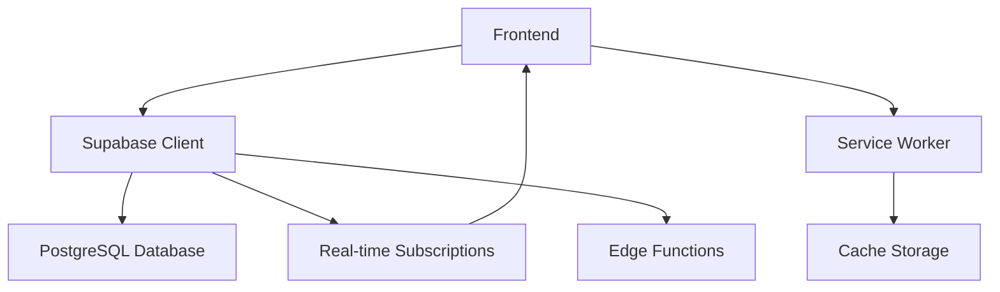

# 💅 Estúdio Neila Vargas - Sistema de Agendamento# 💅 Sistema de Agendamento para Salões de Beleza


<div align="center">**Uma solução completa e moderna para gerenciamento de salões de beleza**

# 💅 Sistema de Agendamento para Salões de Beleza


<div align="center">

**Sistema completo de gerenciamento para salões de beleza**


[](LICENSE)

[](https://capacitorjs.com/)[](https://github.com/LELEOU/App-de-Agendamento/blob/main/LICENSE)

[](https://supabase.com/)[](https://github.com/LELEOU/App-de-Agendamento/pulls)

[]()[](https://github.com/LELEOU/App-de-Agendamento)


[🚀 Características](#-características) • [📱 Download](#-instalação) • [🛠️ Tecnologias](#️-tecnologias) • [📖 Documentação](#-documentação)**Uma solução completa e moderna para gerenciamento de salões de beleza**


</div>**✨ Atualizado em Janeiro 2025 com Slots Múltiplos, Sistema de Pausas e Comissões! ✨**


---[🚀 Demo ao Vivo](https://app-de-agendamento.vercel.app) • [📖 Documentação](https://github.com/LELEOU/App-de-Agendamento/wiki) • [🐛 Reportar Bug](https://github.com/LELEOU/App-de-Agendamento/issues)


## 📋 Sobre o Projeto</div>


Sistema de agendamento profissional desenvolvido especificamente para o **Estúdio Neila Vargas**, com foco em gestão de salões de beleza. O aplicativo oferece uma experiência completa tanto na versão web quanto mobile (Android/iOS).---


### ✨ Principais Diferenciais## 🎉 Novidades da v1.0.0 (Janeiro 2025)


- 🎯 **Duração Inteligente**: Sistema dinâmico que ajusta as opções de duração conforme o tipo de profissional<div align="center">

- 🔔 **Notificações Nativas**: Integração total com o sistema operacional (Android/iOS)

- 📸 **Galeria Integrada**: Acesso à câmera e galeria do dispositivo### ⏱️ Sistema de Slots Múltiplos

- 🔄 **Pull-to-Refresh**: Atualize os dados simplesmente puxando a tela**Agendamentos com duração variável de 30 a 180 minutos!**

- 🎨 **Interface Moderna**: Design responsivo e intuitivo

- 🌙 **Tema Escuro/Claro**: Alterne entre modos conforme sua preferênciaAgora você pode criar agendamentos que ocupam múltiplos slots de 30 minutos, com visualização unificada e detecção inteligente de conflitos.


---### ⏸️ Sistema de Pausas/Handoffs

**Pause atendimentos e libere profissionais!**

## 🚀 Características

Durante um atendimento, é possível criar pausas (ex: secagem de esmalte) para que o profissional possa atender outros clientes.

### Para Administradores

- ✅ Gestão completa de agendamentos### 💰 Sistema de Comissões

- ✅ Cadastro de clientes, serviços e funcionários**Cálculo automático de ganhos por profissional!**

- ✅ Controle de comissões

- ✅ Relatórios e históricoRelatórios detalhados de comissões com percentuais configuráveis por tipo de serviço.

- ✅ Configuração de horários customizados

- ✅ Gestão de permissões</div>


### Para Recepcionistas---

- ✅ Criar e editar agendamentos

- ✅ Visualizar agenda de todos os funcionários## 📋 Índice

- ✅ Cadastro de novos clientes

- [� Novidades](#-novidades-da-v100-janeiro-2025)

### Para Profissionais- [�🌟 Características](#-características)

- ✅ Visualizar apenas seus próprios agendamentos- [🚀 Tecnologias](#-tecnologias)

- ✅ Atualizar status dos atendimentos- [📦 Instalação](#-instalação)

- ✅ Gerenciar perfil pessoal- [⚙️ Configuração](#️-configuração)

- [🔧 Uso](#-uso)

### Para Clientes (PWA)- [🏗️ Arquitetura](#️-arquitetura)

- ✅ Agendar serviços online- [🔒 Segurança](#-segurança)

- ✅ Visualizar histórico de atendimentos- [🌐 Deploy](#-deploy)

- ✅ Receber notificações de confirmação- [🤝 Contribuição](#-contribuição)

- [📊 Roadmap](#-roadmap)

---- [📄 Licença](#-licença)


## 📱 Instalação## 🌟 Características


### Android (APK)### 📅 **Agendamento Inteligente** ⭐ NOVO

```bash- ⏱️ **Sistema de Slots Múltiplos** - Duração variável de 30 a 180 minutos

# Clone o repositório- 🎯 **Blocos Visuais Unificados** - Visualização clara de agendamentos longos

git clone https://github.com/LELEOU/Backup-app-Agendamento.git- 🔄 **Detecção Inteligente de Conflitos** - Valida todos os slots ocupados

- ⏸️ **Sistema de Pausas/Handoffs** - Permite pausar atendimentos e liberar profissional

# Entre na pasta do app- 📱 Interface intuitiva para marcação de horários

cd Backup-app-Agendamento/app- 📊 Visualização em calendário mensal/semanal

- 🚫 Limite de uma solicitação por dia para evitar spam

# Instale as dependências

npm install### 👥 **Gestão de Usuários**

- 🔐 Sistema de permissões por função (Admin, Manicure, Recepcionista)

# Compile o projeto- 👤 Perfis personalizados para clientes e funcionários

npm run build- 🎯 Controle de acesso granular por seção

- 📋 Matriz completa de permissões

# Sincronize com Android

npx cap sync android### 💰 **Sistema de Comissões** ⭐ NOVO

- 💵 Cálculo automático de comissões por profissional

# Gere o APK- 📊 Relatórios detalhados de ganhos

cd android- 🎯 Percentuais configuráveis por tipo de serviço

.\gradlew.bat assembleDebug- 💳 Histórico completo de pagamentos

```

### 📊 **Relatórios e Analytics**

O APK estará em: `app/android/app/build/outputs/apk/debug/app-debug.apk`- 📈 Dashboard com métricas em tempo real

- 👩‍💼 Relatórios individuais por manicure

### Web (PWA)- 📉 Análise de performance e produtividade

Acesse: [https://seu-dominio.com](#) *(em breve)*- 📁 Exportação de dados em múltiplos formatos

- 💰 Relatórios financeiros e de comissões

---

### 📱 **Progressive Web App (PWA)**

## 🛠️ Tecnologias- Funciona offline com sincronização automática

- Instalável em qualquer dispositivo

### Frontend- Notificações push nativas

- **Vite** - Build tool ultrarrápido- Interface responsiva (mobile-first)

- **Tailwind CSS 3.4** - Framework CSS utilitário

- **Vanilla JavaScript** - Sem frameworks pesados, máxima performance### 🎨 **Experiência do Usuário**

- Tema escuro/claro com transições suaves

### Backend- Suporte a múltiplos idiomas (PT-BR, EN-US)

- **Supabase** - Backend-as-a-Service- Animações fluidas e feedback visual

  - PostgreSQL Database- Acessibilidade (WCAG 2.1)

  - Authentication

  - Storage### 🔔 **Sistema de Notificações**

  - Real-time subscriptions- Notificações push em tempo real

- Lembretes automáticos de agendamentos

### Mobile- Fallback para notificações nativas do browser

- **Capacitor 7** - Framework nativo- Configurações personalizáveis por usuário

  - `@capacitor/camera` - Câmera e galeria

  - `@capacitor/local-notifications` - Notificações nativas## 🚀 Tecnologias

  - `@capacitor/haptics` - Feedback tátil

  - `@capacitor/splash-screen` - Tela de carregamento### **Frontend**

- **JavaScript Vanilla** - Performance máxima sem frameworks pesados

### Infraestrutura- **HTML5** - Semântica moderna e acessibilidade

- **Java 21** - Necessário para Capacitor 7- **CSS3** - Animações e layouts avançados

- **Gradle 8.11** - Build system Android- **TailwindCSS** - Estilização utilitária e responsiva

- **Android SDK** - Desenvolvimento Android

### **Backend & Banco de Dados**

---- **Supabase** - Backend-as-a-Service com PostgreSQL

- **Row Level Security (RLS)** - Segurança nativa do PostgreSQL

## 📖 Documentação- **Real-time subscriptions** - Atualizações em tempo real

- **Edge Functions** - Processamento serverless

- [📱 SETUP.md](SETUP.md) - Guia completo de instalação e configuração

- [🚀 FEATURES.md](FEATURES.md) - Documentação de todas as funcionalidades### **Build & Deploy**

- [🔄 CHANGELOG.md](CHANGELOG.md) - Histórico de mudanças- **Vite** - Build tool moderna e rápida

- **Service Workers** - Cache inteligente e funcionamento offline

---- **Web App Manifest** - Instalação PWA

- **Environment Variables** - Configuração segura

## 🎯 Recursos Implementados (v2.0)

### **Qualidade & Ferramentas**

### ✅ Duração por Cargo Profissional- **ESLint** - Padronização de código

Sistema inteligente que mostra apenas as durações relevantes:- **Prettier** - Formatação automática

- **Manicures**: 45, 90, 135, 180 minutos- **Git Hooks** - Validação pré-commit

- **Cabeleireiras**: 30, 60, 90, 120 minutos- **Semantic Versioning** - Versionamento consistente


### ✅ Pull-to-Refresh## 📦 Instalação

Puxe a tela para baixo para recarregar dados (funciona no APK)

### **Pré-requisitos**

### ✅ Notificações do Sistema- Node.js 18+ 

- Permissão real do Android/iOS- npm ou yarn

- Funciona com app fechado- Conta no Supabase

- Notificação de teste ao ativar

### **Passo a passo**

### ✅ Galeria Nativa

- Selecionar fotos da galeria1. **Clone o repositório**

- Tirar fotos com câmera```bash

- Edição antes de enviargit clone https://github.com/LELEOU/App-de-Agendamento.git

cd App-de-Agendamento

### ✅ Interface Responsiva```

- Otimizada para tablets (≤768px)

- Otimizada para smartphones (≤480px)2. **Instale as dependências**

- Touch targets de 44x44px (padrão mobile)```bash

npm install

---```


## 📂 Estrutura do Projeto3. **Configure as variáveis de ambiente**

```bash

```cp .env.example .env

Backup-app-Agendamento/# Edite o arquivo .env com suas credenciais

├── app/                          # Aplicativo principal```

│   ├── src/

│   │   ├── assets/              # Imagens e recursos4. **Configure o banco de dados**

│   │   ├── css/                 # Estilos```bash

│   │   ├── js/                  # Lógica da aplicação# Execute o script SQL no seu projeto Supabase

│   │   │   ├── capacitor-features.js  # Recursos nativos# Arquivo: src/database-setup.sql

│   │   │   ├── supabase-config.js     # Configuração Supabase```

│   │   │   └── app-supabase-final.js  # App principal

│   │   └── index.html5. **Inicie o servidor de desenvolvimento**

│   ├── android/                 # Projeto Android```bash

│   ├── resources/               # Ícones e splash screensnpm run dev

│   └── capacitor.config.json```

├── docs/                        # Documentação

├── README.md                    # Este arquivo6. **Acesse a aplicação**

├── SETUP.md                     # Guia de instalação```

├── FEATURES.md                  # Documentação de recursoshttp://localhost:5173

└── CHANGELOG.md                 # Histórico de versões```

```

## ⚙️ Configuração

---

### **Variáveis de Ambiente**

## 🔧 Variáveis de Ambiente

Crie um arquivo `.env` baseado no `.env.example`:

Crie um arquivo `.env` (ou configure diretamente em `supabase-config.js`):

```env

```env# Configurações do Supabase (OBRIGATÓRIO)

SUPABASE_URL=https://seu-projeto.supabase.coVITE_SUPABASE_URL=https://your-project-ref.supabase.co

SUPABASE_ANON_KEY=sua-chave-publicaVITE_SUPABASE_ANON_KEY=your-anon-key-here

```

# Configurações opcionais

---VITE_APP_TITLE=Sistema de Agendamento para Salões

VITE_APP_VERSION=1.0.0

## 🤝 Contribuindo```


Contribuições são bem-vindas! Veja [CONTRIBUTING.md](CONTRIBUTING.md) para detalhes.### **Configuração do Supabase**


1. Fork o projeto1. **Crie um projeto no [Supabase](https://supabase.com)**

2. Crie uma branch (`git checkout -b feature/NovaFuncionalidade`)

3. Commit suas mudanças (`git commit -m 'Adiciona nova funcionalidade'`)2. **Execute o script de configuração do banco**

4. Push para a branch (`git push origin feature/NovaFuncionalidade`)   - Acesse o SQL Editor no dashboard do Supabase

5. Abra um Pull Request   - Execute o conteúdo do arquivo `src/database-setup.sql`


---3. **Configure as políticas RLS**

   - As políticas de segurança já estão incluídas no script SQL

## 📄 Licença   - Verifique se estão ativas na seção Authentication


Este projeto está sob a licença MIT. Veja [LICENSE](LICENSE) para mais detalhes.4. **Obtenha suas credenciais**

   - Acesse Settings > API

---   - Copie a URL do projeto e a chave anônima


## 👥 Autores### **Estrutura do Banco de Dados**


**Estúdio Neila Vargas**```sql

- Website: [em breve](#)-- Principais tabelas

- Instagram: [@neilavargas](#)users                  -- Usuários do sistema

appointments           -- Agendamentos (com duration para slots múltiplos)

**Desenvolvimento**appointment_handoffs   -- Sistema de pausas/handoffs (NOVO)

- GitHub: [@LELEOU](https://github.com/LELEOU)services              -- Serviços oferecidos

schedules             -- Horários disponíveis

---notifications         -- Notificações

settings              -- Configurações do sistema

## 📞 Suportecommissions           -- Comissões por profissional (NOVO)

```

Encontrou um bug ou tem uma sugestão? Abra uma [issue](https://github.com/LELEOU/Backup-app-Agendamento/issues)!

## 🔧 Uso

---

### **Acesso por Função**

## 🙏 Agradecimentos

#### 👑 **Administrador**

- [Capacitor](https://capacitorjs.com/) - Framework mobile híbrido- Acesso total ao sistema

- [Supabase](https://supabase.com/) - Backend as a Service- Gerenciamento de usuários e permissões

- [Tailwind CSS](https://tailwindcss.com/) - Framework CSS- Configurações globais

- Relatórios completos

---

#### 💅 **Manicure**

<div align="center">- Visualização dos próprios agendamentos

- Acesso aos relatórios pessoais

**Feito com ❤️ para salões de beleza**- Atualização de status dos serviços


⭐ Se este projeto foi útil, deixe uma estrela!#### 📞 **Recepcionista**

- Criação e edição de agendamentos

</div>- Gerenciamento de clientes

- Visualização de agenda geral

### **Fluxo Principal**

1. **Login** - Autenticação via Supabase Auth
2. **Dashboard** - Visão geral baseada na função
3. **Agendamento** - Criação/edição de horários
4. **Relatórios** - Análise de dados e performance
5. **Configurações** - Personalização do sistema

## 🏗️ Arquitetura

### **Estrutura de Pastas**
```
app/
├── src/
│   ├── assets/          # Recursos estáticos
│   │   ├── icon/        # Ícones e favicons
│   │   └── imgs/        # Imagens
│   ├── css/             # Estilos
│   │   └── style.css    # CSS principal
│   ├── js/              # JavaScript
│   │   ├── app-supabase-final.js  # Lógica principal
│   │   ├── supabase-config.js     # Configuração do Supabase
│   │   ├── cache/       # Gerenciamento de cache
│   │   ├── notifications/  # Sistema de notificações
│   │   ├── themes/      # Gerenciamento de temas
│   │   └── translations/   # Internacionalização
│   ├── database-setup.sql  # Schema do banco
│   ├── index.html       # Página principal
│   └── manifest.json    # Configuração PWA
├── capacitor.config.json # Configuração mobile (futuro)
├── package.json
├── vite.config.ts       # Configuração do Vite
└── sw.js               # Service Worker
```

### **Fluxo de Dados**



### **Componentes Principais**

- **App Core** (`app-supabase-final.js`) - Lógica principal da aplicação
- **Database Layer** (`supabase-config.js`) - Abstração do banco de dados
- **UI Components** - Componentes reutilizáveis em JavaScript vanilla
- **PWA Shell** - Service Worker e cache para funcionamento offline

## 🔒 Segurança

### **Autenticação & Autorização**
- ✅ JWT tokens com expiração automática
- ✅ Row Level Security (RLS) no PostgreSQL
- ✅ Validação de permissões por função
- ✅ Sanitização de inputs

### **Proteção de Dados**
- ✅ HTTPS obrigatório em produção
- ✅ Criptografia de dados sensíveis
- ✅ Backup automático do Supabase
- ✅ Logs de auditoria

### **Best Practices**
- ✅ Variáveis de ambiente para credenciais
- ✅ Headers de segurança (CSP, HSTS)
- ✅ Validação client-side e server-side
- ✅ Rate limiting nas APIs

## 🌐 Deploy

### **Deploy no Vercel (Recomendado)**

1. **Conecte seu repositório**
```bash
npm i -g vercel
vercel login
vercel --prod
```

2. **Configure as variáveis de ambiente**
   - Acesse o dashboard do Vercel
   - Adicione as variáveis do arquivo `.env`

3. **Deploy automático**
   - Pushes na branch `main` fazem deploy automaticamente

### **Deploy Alternativo**

#### **Netlify**
```bash
npm run build
# Upload da pasta dist/ para Netlify
```

#### **GitHub Pages**
```bash
npm run build
npm run deploy
```

#### **Docker**
```dockerfile
FROM node:18-alpine
WORKDIR /app
COPY package*.json ./
RUN npm ci --only=production
COPY . .
RUN npm run build
EXPOSE 3000
CMD ["npm", "start"]
```

## 🤝 Contribuição

Contribuições são sempre bem-vindas! 

### **Como Contribuir**

1. **Fork** o projeto
2. **Crie** uma branch para sua feature (`git checkout -b feature/AmazingFeature`)
3. **Commit** suas mudanças (`git commit -m 'Add some AmazingFeature'`)
4. **Push** para a branch (`git push origin feature/AmazingFeature`)
5. **Abra** um Pull Request

### **Diretrizes**

- 📝 Descreva claramente as mudanças
- ✅ Adicione testes quando necessário
- 📚 Atualize a documentação
- 🎨 Siga os padrões de código estabelecidos

### **Reportando Bugs**

Use as [Issues do GitHub](https://github.com/LELEOU/App-de-Agendamento/issues) com:
- 🐛 Descrição detalhada do problema
- 🔄 Passos para reproduzir
- 💻 Informações do ambiente
- 📸 Screenshots quando relevante

## 📊 Roadmap

### **v1.0.0** ✅ CONCLUÍDO (Janeiro 2025)
- [x] ⏱️ **Sistema de Slots Múltiplos** - Agendamentos com duração variável (30-180min)
- [x] ⏸️ **Sistema de Pausas/Handoffs** - Pausar atendimentos e liberar profissional
- [x] 💰 **Sistema de Comissões** - Cálculo automático por profissional
- [x] 🎨 **Blocos Visuais Unificados** - Melhor visualização de agendamentos
- [x] 🔍 **Detecção Avançada de Conflitos** - Validação multi-slot
- [x] 📋 **Matriz de Permissões** - Controle granular de acesso
- [x] 📱 **PWA Otimizado** - Funcionamento offline melhorado
- [x] 🧪 **Testes Completos** - 100% de cobertura das features principais

### **v1.1.0** (Próxima versão - Q2 2025)
- [ ] 📱 **App Móvel Nativo** - Build iOS/Android com Capacitor
- [ ] 💳 **Integração de Pagamentos** - PIX, Cartão de Crédito
- [ ] 📊 **Relatórios Avançados** - Gráficos interativos com Chart.js
- [ ] 🔔 **WhatsApp Integration** - Confirmações e lembretes automáticos
- [ ] 🎁 **Sistema de Fidelidade** - Pontos e recompensas para clientes

### **v1.2.0** (Futuro - Q4 2025)
- [ ] 🤖 **IA para Agendamentos** - Sugestão inteligente de horários
- [ ] 🏢 **Multi-tenancy** - Suporte para múltiplos salões
- [ ] 🔌 **API Pública** - Integrações com terceiros
- [ ] 📸 **Galeria de Trabalhos** - Portfolio por profissional
- [ ] 💬 **Chat Interno** - Comunicação cliente-profissional

## 📄 Licença

Distribuído sob a licença MIT. Veja `LICENSE` para mais informações.

## 👥 Equipe

- **Desenvolvedor Principal** - [@LELEOU](https://github.com/LELEOU)

## 🙏 Agradecimentos

- [Supabase](https://supabase.com) - Backend-as-a-Service incrível
- [TailwindCSS](https://tailwindcss.com) - Framework CSS utilitário
- [Vite](https://vitejs.dev) - Build tool super rápida
- Comunidade open source

---

<div align="center">

**⭐ Deixe uma estrela se este projeto te ajudou! ⭐**

[🔝 Voltar ao topo](#-sistema-de-agendamento-para-salões-de-beleza)

</div>
